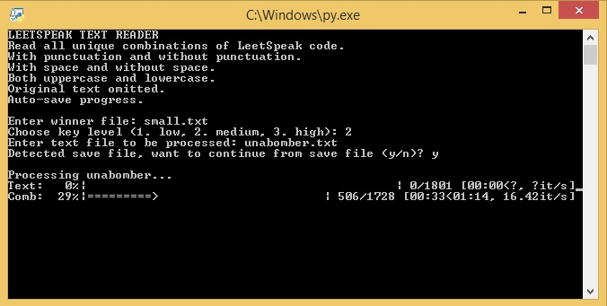

# Bitcoin Wallet Generator

Various tools for Bitcoin brute-force. For educational purposes only.



## Getting Started

### Dependencies

To be able to use the program, you should install all the dependencies:

```
pip install -r requirements.txt
```

### Installing

To download this program, enter the following command in your terminal:

```
git clone https://github.com/erichoangnle/btc_brute_force.git
```

## Usage

#### random_bytes.py

Generate random Bitcoin wallets and check for collisions. Directory 'winner' contain
two text files consist of list of Bitcoin address with positive balances. Default 'winner'
file to check is 'small.txt'. 

#### random_words.py

Generate bitcoin wallet using random N-words as private keys and check for collisions. Manually choose
which winner file (small.txt or large.txt) to check. Manually enter the number of words in private keys.
The standard number of words in BTC seed phrase is 24, 28, or 12. Words are chosen randomly from the 
standard BIP39 words list.

The Bitcoin Improvement Proposal 39 wordlist (or ‘BIP39’ for short) is a standardized set of words for 
the recovery and backup of a bitcoin or cryptocurrency wallet.

#### reader_ceasar.py

Read a text file and use each sentence's  possible Ceasar Shifts as private key to generate bitcoin wallet.
Check for collisions.

Example of Ceasar Shift: right shift of 23 or left shift of 3

```
Plaintext:  THE QUICK BROWN FOX JUMPS OVER THE LAZY DOG
Ciphertext: QEB NRFZH YOLTK CLU GRJMP LSBO QEB IXWV ALD
```

#### reader_leetspeak.py

Leet (or "1337"), also known as eleet or leetspeak, is a system of modified spellings used primarily on the 
Internet. It often uses character replacements in ways that play on the similarity of their glyphs via 
reflection or other resemblance.

Example:

```
Origiral text: For education purposes only
Encrypted:     F0r 3DUC4710N PUrP0535 0N1Y
```

Read a text file and use each sentence's Leetcode as private key to generate Bitcoin wallet. Check database for 
collisions. Three mdoes of encryption (from simple to complex) are provided. Manually choose which mode you would
like to use.

Example:

```
Original text: Three different modes of encryption
Simple mode:   7Hr33 D1FF3r3N7 M0D35 0F 3NCrYP710N
Complex mode:  7(-)|2є[- |]]ƒ/=3®[-|\|† |\/|[]|)[-_/¯ []|= є/\/[|2'/|º†][()[\]
```

## Contact

Email: erichoangnle@gmail.com

Facebook: https://www.facebook.com/eric.le.520900

Project link: https://github.com/erichoangnle/btc_brute_force.git
